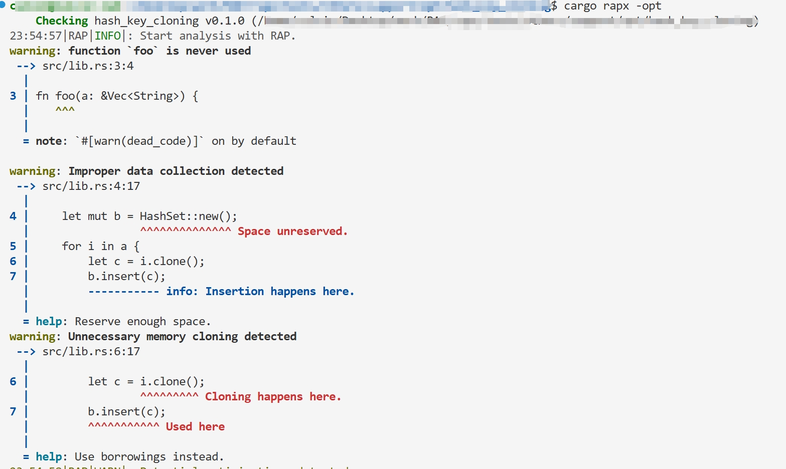

### Dataset

The research cases are documented in **`dataset.md`**, each annotated with detailed hyperlinks to relevant resources.

### Analysis Tool

The automated detection tool is implemented as a module of **RAPx** – a static analysis platform for Rust code.

#### Source Code

Core implementation: **`./tool/`**

#### Installation

1. Prerequisites: Ensure the Rust version specified in `rust-toolchain.toml` is installed.
2. One-step setup:
   
   ```shell
   ./install.sh
   ```
   
> Full installation guide: `./tool/README.md`

#### Usage

Run the analysis on any Rust project:

```shell
cargo rapx -opt
```

This will report optimization opportunities detected by the tool.

#### Effect

Here is an example of its effect:

```rust
//code snippet:
use std::collections::HashSet;

fn foo(a: &Vec<String>) {
    let mut b = HashSet::new();
    for i in a {
        let c = i.clone();
        b.insert(c);
    }
}
```


